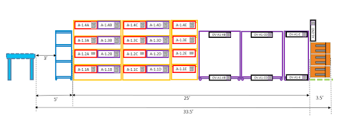

# ACMS-CAD-File-Viewer

## Problem Statement
* The goal of this project is to build a web page which can open and render a CAD file as HTML content, so that one can add more HTML objects on top of that building layout, if    required.
* The CAD file consists of 10 aisles, each aisle containing 30 racks and 30 overflow racks in a work station.
An example of the aisle with the naming convention is as shown in the picture. 

### Our aim:
1. Annotate the CAD file.
2. Render the CAD file as HTML content.
3. Highlight the searched aisle, rack, shelf, bin or overflow rack.

## How to use?
>- Move to the current directory.
>- Setup a localhost server.
>- Run [**cadFileViewer.html**](cadFileViewer.html)
