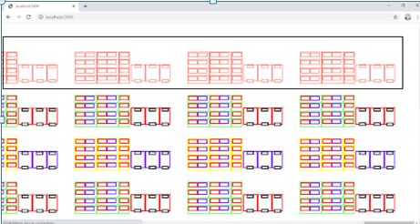
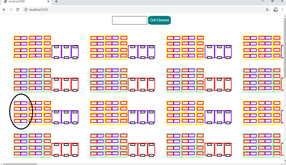
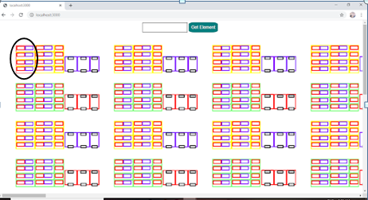

# ACMS-CAD-File-Viewer

## Problem Statement
* The goal of this project is to build a web page which can open and render a CAD file as HTML content, so that one can add more HTML objects on top of that building layout, if    required.
* The CAD file consists of 10 aisles, each aisle containing 30 racks and 30 overflow racks in a work station.
An example of the aisle with the naming convention is as shown in the picture. 

### Our aim:
1. Annotate the CAD file.
2. Render the CAD file as HTML content.
3. Highlight the searched aisle, rack, shelf, bin or overflow rack.

## Research & Development
### Tools Explored: 
1. Autodesk forge
2. Three.js npm (Open Source)
3. WebGL API (Open Source)
4. Zamzar (Online conversion tool)
### File Formats Explored:
1. DWG (for drawing)
2. DXF (Drawing Exchange Format)
3. STL
4. VRML
5. OBJ

Search space was reduced to 2D DWG (suggested format), converting it into an intermediate file format (content of a DWG is unreadable), then to HTML (impractical to directly convert DWG to an HTML file).

### DWG file conversion to other file formats: 
KML, DXF, PDF, SVG(Scalable Vector Graphics)

### SVG file format is the preferred choice of input:
* It is an **Extensible Markup Language**-based vector image format for 2D graphics.
* Describes an image using a **text format** and hence it is a **readable** format and its content is similar to HTML (shapes are defined using tags).
* **No third party API** or tool required **for conversion to HTML**.
* Can be **loaded to HTML as a DOM** using **object** tag, and hence we can attach **JavaScript event handlers** for an element, performing actions on individual elements.
* Supported by most of the web browsers.
  
## Implementation Details 
* The SVG file provided by the user is **manually annotated and grouped accordingly**.
* **Loads SVG file** (function loadSVG()) as a DOM object using the object tag on load of the window, and **adds onClick listener** to all the SVG elements (changes color on clicking of   the element).
* **Adds CSS file** for styling the DOM objects and **modularizing** the CSS file by adding different classes.
* **Apply CSS changes** (function applyCSS()), **adds class cluster_rack_shelf and bin** to the element if a particular cluster/rack/shelf or bin id is entered by the user (**changes color** accordingly). 
* Adds **undo** functionality using a stack, i.e., on entering a new id, previous changes are undone.

## How to use?
* Move to the current directory.
* Setup a **localhost server**.
* Run [**cadFileViewer.html**](cadFileViewer.html)

## Demo/Screenshots
* Setting up a **local host server**
* Working Application
  ### Search Functionality
  **Color** of the searched element(aisle in this case) changes to **Salmon** and **stroke width** changes to **2**.
  
  
  
  ### Hover Functionality
  **Color** of the hovered element(rack in this case) changes to **Sky Blue** and **stroke width** changes to **2**.
  
  
  
  ### Click Functionality
  **Color** of the clicked element(rack in this case) changes to **Red** and **stroke width** changes to **2**.
  
  

## Scope for Future Innovation
The user should be able to:

1. **Upload** the SVG file from **various sources**(local storage, remote servers), **convert any CAD file format** to SVG file format along with **automating annotation** of the file as per user specification.
2. **Redo, clear** changes, add **more styling** (options to choose among different colors/ patterns, add text), add **more elements**(shapes that will represent bins/ racks/ packages) to the existing SVG file, along with **zoom-in/ zoom-out** functionality.
3. **Save** the modified SVG file in **different formats**(pdf, jpeg, etc.).
4. **Associate database** with the SVG file for the following queries:
    * **Check** if the inputted bin/ rack id is occupied/ unoccupied.
    * **Get the product details** present at the particular inputted bin/ rack id.
    * **Update database/ SVG file** whenever an item is placed/ removed from bin/ rack.
5. **Associate** each bin with **weights/ size** of the package, and hence use this information to find the available/ unoccupied bin for that package.

